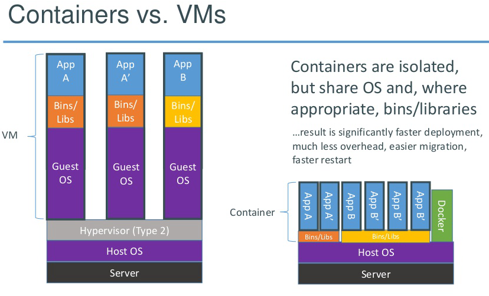

<span style="font-size:1.4em; font-weigth: 400; color: #073642;">Docker for reproducible science</span>


Bruno Vieira | <i class="fa fa-twitter"></i> <a href="//twitter.com/bmpvieira" target="_blank">@bmpvieira</a> | 


<a target="_blank" href="http://docker.io"></a>
<a target="_blank" href="http://www.slideshare.net/dotCloud/docker-intro-november">&nbsp;</a>

<p style="line-height: .8em">
<i style="font-size: .7em; vertical-align: middle;" class="fa fa-github-alt"></i><a href="http://github.com/yeban/afra"><span style="font-size: .7em; line-height: .7em;"> yeban/afra</span></a>
</p>

<p style="line-height: .8em">
<i style="font-size: .7em; vertical-align: middle;" class="fa fa-github-alt"></i><a href="http://github.com/lh3/psmc"><span style="font-size: .7em; line-height: .7em;" >  lh3/psmc</span></a>
</p>

<p style="line-height: .8em">
<i style="font-size: .7em; vertical-align: middle;" class="fa fa-github-alt"></i><a href="http://github.com/maxogden/dat"><span style="font-size: .7em; line-height: .7em;" >  maxogden/dat</span></a>
</p>

<p style="line-height: .8em">
<i style="font-size: .7em; vertical-align: middle;" class="fa fa-github-alt"></i><a href="http://github.com/jbenet/datadex"><span style="font-size: .7em; line-height: .7em;" >  jbenet/datadex</span></a>
</p>

<div style="clear: both;"></div>

```bash
docker run bmpvieira/thesis -name thesis_reproduce make
```

<small>
© 2014 <a href="//bmpvieira.com" target="_blanl">Bruno Vieira</a> <a href="//creativecommons.org/licenses/by/4.0/deed.en_US" target="_blank">CC-BY 4.0</a> | 
<a href="//bmpvieira.com/cw14" target="_blank">bmpvieira.com/cw14</a>
</small>
